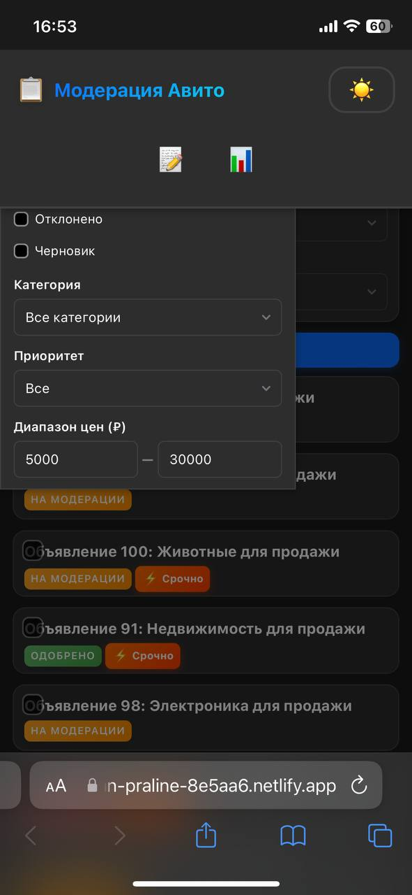
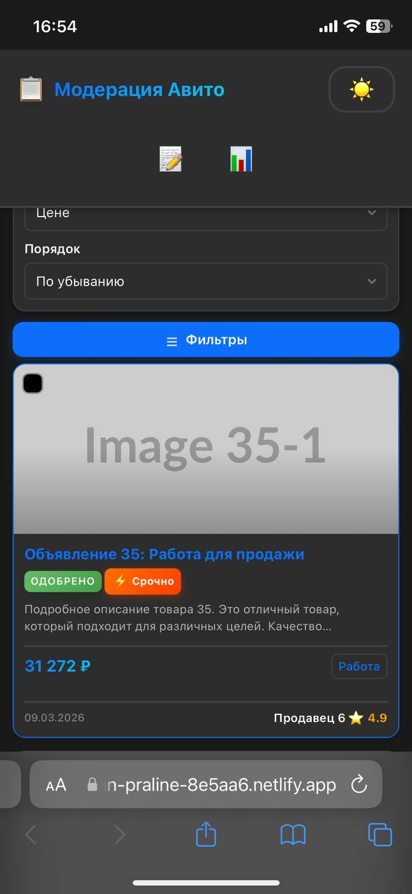

## BUG-001: Десктопная версия сайта не загружается

**Проект:** Платформа модерации объявлений https://cerulean-praline-8e5aa6.netlify.app/

**Серьёзность:** Критический  
**Приоритет:** P0

**Окружение:**
- ОС: Windows 11
- Браузер: Яндекс 26.3.2.773
- Разрешение экрана: 1920x1080

**Шаги воспроизведения:**
1. Открыть браузер на ноутбуке
2. Перейти на сайт платформы модерации
3. Дождаться загрузки страницы

**Ожидаемый результат:**
Страница загружается, отображается интерфейс платформы, доступны все функции.

**Фактический результат:**
Страница не загружается. В консоли браузера (F12) появляется ошибка: Failed to load resource: net::ERR_CONNECTION_RESET. При этом на мобильном устройстве (iPhone, Safari) сайт открывается и работает корректно.

**Статус:** Открыт

**Автор:** Анастасия Петрова

**Исполнитель:** Разработчик

**Вложения и дополнения:**
- Скриншот ошибки из консоли браузера:

- Проблема воспроизводится на всех десктопных браузерах

---

## BUG-002: Тогл "Только срочные" не фильтрует объявления

**Проект:** Платформа модерации объявлений https://cerulean-praline-8e5aa6.netlify.app/

**Серьёзность:** Серьезный  
**Приоритет:** P1

> **Примечание:** тестирование выполнено на мобильной версии, так как десктопная недоступна (BUG-001).

**Окружение:**
- ОС: iOS 17.7.2
- Браузер: Safari
- Устройство: iPhone 12

**Шаги воспроизведения:**
1. Открыть главную страницу платформы
2. Убедиться, что в списке присутствуют как обычные, так и срочные объявления (с пометкой "Срочно")
3. Найти тогл "Только срочные"
4. Включить тогл (перевести в активное состояние)
5. Посмотреть на список объявлений

**Ожидаемый результат:**
После включения тогла в списке остаются только объявления с пометкой "Срочно". Обычные объявления (без пометки) скрываются из выдачи.

**Фактический результат:**
После включения тогла "Только срочные" список объявлений не меняется. В выдаче продолжают отображаться как срочные, так и обычные объявления. Фильтрация не происходит. Тогл визуально переключается, но не влияет на содержимое страницы.

**Статус:** Открыт

**Автор:** Анастасия Петрова

**Исполнитель:** Разработчик

**Вложения и дополнения:**
- Скриншот списка объявлений до включения тогла:

- Скриншот списка объявлений после включения тогла:

---

## BUG-003: Кнопки "Старт" и "Обновить" не работают после нажатия "Стоп" на странице статистики

**Проект:** Платформа модерации объявлений https://cerulean-praline-8e5aa6.netlify.app/

**Серьёзность:** Серьезный  
**Приоритет:** P1

> **Примечание:** тестирование выполнено на мобильной версии, так как десктопная недоступна (BUG-001).

**Окружение:**
- ОС: iOS 17.7.2
- Браузер: Safari
- Устройство: iPhone 12

**Шаги воспроизведения:**
1. Открыть главную страницу платформы
2. Перейти на страницу просмотра статистики
3. Убедиться, что таймер автоматического обновления работает
4. Нажать кнопку "Пауза" - таймер останавливается
5. Нажать кнопку "Старт"
6. Нажать кнопку "Обновить"

**Ожидаемый результат:**
После нажатия кнопки "Старт" таймер должен запуститься с того места, на котором остановился. После нажатия кнопки "Обновить" таймер должен пойти заново с начала

**Фактический результат:**
После нажатия кнопки "Стоп":
- Кнопка "Старт" не запускает таймер
- Кнопка "Обновить" не обновляет таймер
- Обе кнопки визуально нажимаются, но не выполняют свои функции

**Статус:** Открыт

**Автор:** Анастасия Петрова

**Исполнитель:** Разработчик

---

## BUG-004: Фильтр "Диапазон цен" не ограничивает вывод по верхней границе

**Проект:** Платформа модерации объявлений https://cerulean-praline-8e5aa6.netlify.app/

**Серьёзность:** Серьезный  
**Приоритет:** P1

> **Примечание:** тестирование выполнено на мобильной версии, так как десктопная недоступна (BUG-001).

**Окружение:**
- ОС: iOS 17.7.2
- Браузер: Safari
- Устройство: iPhone 12

**Шаги воспроизведения:**
1. Открыть главную страницу платформы
2. Открыть вкладку "Фильтры"
3. В поле "Диапазон цен от" ввести 5000
4. В поле "Диапазон цен до" ввести 30000
5. Просмотреть список отфильтрованных объявлений

**Ожидаемый результат:**
В списке отображаются только объявления с ценой от 5000 до 30000 рублей включительно. Объявления с ценой ниже 5000 и выше 30000 не показываются.

**Фактический результат:**
Нижняя граница работает корректно: объявления с ценой ниже 5000 отсутствуют. Верхняя граница не работает: в списке присутствуют объявления с ценой выше 30000 рублей

**Статус:** Открыт

**Автор:** Анастасия Петрова

**Исполнитель:** Разработчик

**Вложения и дополнения:**
- Скриншот фильтра с введёнными значениями:

- Скриншот выдачи с объявлением дороже 30000 рублей:

